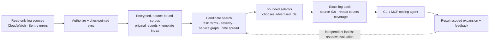

# Evidentrail

**Give coding agents the logs that matter.** Connect a log source, describe the bug, and hand the agent a focused pack of **original log lines** it can inspect and expand. Evidentrail searches accessible history without requiring an incident time window, groups repeated events, and uses the task and observed service relationships to find candidates.

The result is small enough to fit an agent workflow, yet every returned line points back to its source. No paraphrased “evidence,” no invented log text. Coverage and truncation travel with the pack so the agent knows what it has actually seen.

| Verified fixes | Log pack | Indexed search |
| ---: | ---: | ---: |
| **7** | **16 of 2,000 lines** | **351 ms at 1M records** |
| Current route in a 12-bug held-out repair study; the no-logs arm also fixed 7. | One 4 KiB BGL task; exact lines, with expansion available. | One local debug-build synthetic query; excludes model and sync time. |

These are [measured examples](#measured-results), not production guarantees. Evidentrail is a **research preview**: the connected CLI and MCP path works locally, while live-provider coverage and a repair advantage over simple baselines remain unproven.

## What it does

- **Connect and keep up:** checkpointed backfill and continuous sync for read-only CloudWatch log groups and Sentry project error events. Each source has its own encrypted corpus and authorization checks.
- **Compress without rewriting evidence:** group repeated templates for indexing, then return selected **exact source records**, source IDs, and repeat counts under a raw-byte budget. Expand a selected record into bounded chronological neighbors.
- **Search by task, not by guessed timestamp:** lexical matches, severity, service summaries, an explicit-peer service graph, and time-spread fallback form a bounded candidate pool. A local or hosted selector chooses only advertised IDs.
- **Expose uncertainty:** source freshness, failed syncs, candidate limits, and output truncation travel with the result, separate from the log text.
- **Learn cautiously:** selected-line feedback is stored per source. Independently labeled development records can reorder source-local candidates in a shadow route; held-out repairs, measured cost, versioned promotion, and rollback gate any live change. Ratings alone do not automatically train ranking.

## System architecture



The model can choose records; it cannot invent the returned log text. Source bytes remain available for verification and expansion. The service graph is built only from relationships observable in logs, such as explicit peer-service fields; it is not an inferred map of every dependency. [Design and limits](docs/LOG_ONLY_PRODUCT_PLAN.md) · [Source-coverage gates](docs/SOURCE_COVERAGE_GATES.md) · [Learning policy](docs/ROUTE_POLICY.md)

## Try it

Requires macOS, Rust 1.88+, a read-only AWS profile for the CloudWatch example, and either a running [Ollama](https://ollama.com/) model with a 32K context or `OPENAI_API_KEY` for hosted selection. Start with a local model to keep log selection local.

```sh
cargo build --release -p evidentrail-cli --bin evidentrail
target/release/evidentrail sources setup
target/release/evidentrail sources connect-cloudwatch \
  --account 123456789012 --region us-west-2 \
  --log-group /aws/example --profile my-readonly-profile
target/release/evidentrail sources sync
target/release/evidentrail sources list

EVIDENTRAIL_COMPACT_LOCAL_MODEL=qwen3:14b \
  target/release/evidentrail logs \
  --task "Find the logs that explain failed checkout requests" \
  --max-raw-bytes 32768
```

`sources setup` reports the next connection, sync, recovery, or query action without exposing credentials. `logs` searches connected, currently authorized sources and writes selected original records as JSONL; source status and truncation metadata go to stderr. The byte budget limits raw log bytes, not rendered JSON or model tokens. For an agent tool loop, run `target/release/evidentrail serve-mcp` and use `evidentrail_connected_logs` followed by `evidentrail_connected_expand`. The expansion handle expires after 30 minutes and checks source access again.

For a single supplied file, `compact` is a separate, bounded local-input prototype:

```sh
EVIDENTRAIL_COMPACT_LOCAL_MODEL=qwen3:14b \
  target/release/evidentrail compact \
  --task "Find logs relevant to checkout failures" < app.log
```

The supplied-log path has a 16 MiB input limit and does not create a continuously synced corpus. [Full CLI and onboarding details](docs/LOG_ONLY_PRODUCT_PLAN.md) · [Source adapter contract](docs/SOURCE_ADAPTER_CONTRACT.md)

## Measured results

Every figure below has a specific fixture and budget. The held-out repair study did **not** show a fix-rate advantage over simple baselines. The result gives us a concrete target for improving retrieval, rather than a production accuracy claim.

| Question | Measured result | Scope |
| --- | --- | --- |
| **Does retrieval help verified fixes?** | Current route **7 fixes**; no logs **7**; first-ID **8**; severity **7**. Shadow memory on **4**, memory off **5**. | [Frozen six-arm BugsInPy study](reports/learning-repair-2026-09-24/REPORT.md): 12 bugs, 3 projects, same 1 KiB log budget and repair-agent model. No route qualified for promotion. |
| **How much does the index group?** | **2,000 original lines → 1,374 template groups** (31.3% fewer groups). | [Pinned real LogHub BGL sample](reports/connected-loghub-bgl-2026-09-23.md). Grouping retains original bytes; it is not a 31.3% storage-size claim. |
| **How small can a returned pack be?** | **16 exact lines from 2,000** (99.2% fewer lines presented) under a 4 KiB cap. | One BGL task with a deterministic first-ID selector; a required alert was returned and its neighbor recovered by expansion. This is output reduction, not general relevance recall. |
| **How fast is local indexed search?** | At **1 million records**, indexed query **351 ms**; fallback **270 ms**. | [Single debug-build synthetic scale exercise](reports/connected-scale-local-2026-09-23.md) with a deterministic selector. Excludes provider sync and model time; not a latency SLO. |
| **How fast was model selection in the repair study?** | Current selector-pack preparation: **4.5 s median**, **12.6 s p95**. | Twelve local study cases; includes scratch-corpus loading and model selection, excludes live provider catch-up and coding-agent edits. Computed from the [frozen pack lock](reports/learning-repair-2026-09-24/pack-lock.json). |

The repair study checked every buggy/fixed control and reran hidden regression tests for all 72 agent-edited trials. The current route fixed the same number as no logs, while the learner fixed fewer. The [case-level report](reports/learning-repair-2026-09-24/REPORT.md) includes failures, p95 end-to-end repair latency, exact-source audit, and CLI token usage. Dollar figures there are **API list-price proxies**, not provider billing receipts; missing metered cost blocks promotion.

## Continuous learning, with an evidence gate

Feedback from a selected result is attached to its exact source record and task. User ratings are weak signals, so they do not silently change cross-task ranking. The source-local learner uses separately labeled development records (blind model annotations in the current study), evaluates memory-on versus memory-off on frozen repairs, and stays in shadow until the downstream benefit and cost gates pass. Route versions retain a training fingerprint and support atomic rollback; stale labels or revoked sources cause selection to fall back to the current route.

Today, that gate **did not pass**: memory on fixed 4 bugs versus 5 with memory off in the 12-bug study. This is an active research area, not a shipped self-improving accuracy claim. [How the route is governed](docs/ROUTE_POLICY.md) · [Study protocol](docs/LEARNING_REPAIR_STUDY.md)

## Release status

| Surface | Current state |
| --- | --- |
| CloudWatch connected logs | Read-only registration, encrypted backfill, sync, query, and expansion are implemented; live AWS sandbox and full-history coverage validation remain open. |
| Sentry | Project **error events** are implemented and contract-tested; live-project validation is open. This is not complete Sentry structured-log ingestion. |
| Datadog | Registration and credential handling exist, but sync and cached queries fail closed until Data Access Control scope can be verified safely. |
| CLI / MCP | Connected query, exact-line output, source-scoped expansion, and onboarding status are implemented on macOS. Live credential and LaunchAgent operation need validation. |
| Learning and default model | Cross-task learning is shadow-only. The held-out study did not qualify a better selector or prove a repair advantage. Provider-metered cost is unavailable. |

For a pilot, verify each source's access and freshness status before trusting a pack. The product never claims that a bounded result contains **all** relevant lines. [Implementation status](docs/LOG_ONLY_PRODUCT_PLAN.md) · [Security model](SECURITY.md)

## Development

```sh
cargo +1.88.0 fmt --all -- --check
cargo +1.88.0 clippy --workspace --all-targets -- -D warnings
cargo +1.88.0 test --workspace --all-targets
python3 -m unittest discover -s scripts -p 'test_*.py'
```

The older `analyze` and `brief` research commands remain in the workspace while the connected log-only path is validated. Their incident-analysis results are documented separately; they are not the connected product described here.

Licensed under either [Apache 2.0](LICENSE-APACHE) or [MIT](LICENSE-MIT), at your option.
