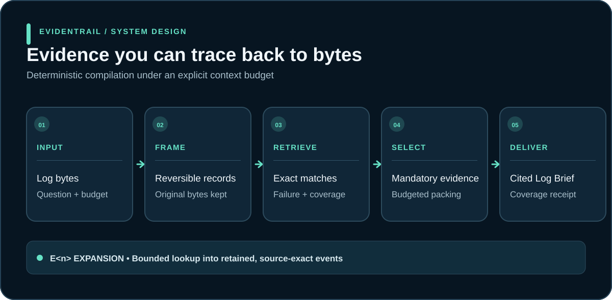

# Evidentrail

**Question-aware log compression for debugging agents.**

Evidentrail turns a large diagnostic log and a debugging question into a
budget-bounded evidence brief for coding agents. Its goal is to retain the
events needed to diagnose the problem at a smaller context cost. Selected
events keep their original bytes, citations expand to the source, and the
brief reports what was omitted. Exact provenance makes an answer auditable;
it does not by itself prove that the right events were selected.



*Source-exact citations in the brief expand into bounded events retained from the authorized input.*

## The product

Large logs create a bad tradeoff for an agent: send everything and waste the
context window, truncate and miss the cause, or summarize and lose the proof.
Evidentrail introduces a fourth option—a compact evidence layer between raw
telemetry and the reasoning model.

Give it logs such as CI output, compiler failures, service incidents, or
Kubernetes events. Ask a concrete question. Evidentrail selects an evidence
set under the supplied budget, with exact `E<n>` handles back to the retained
source.

| Capability | Product behavior |
|---|---|
| Exact when small | If the authorized input already fits, it passes through unchanged. |
| Evidence selection | It combines exact identifiers, failure/onset roles, source coverage, and authorized correlations. |
| Honest incompleteness | If mandatory evidence cannot fit, it returns `needs_more` instead of a confident-looking partial answer. |
| Byte fidelity | Invalid UTF-8, duplicate events, record boundaries, and multiline stacks remain reversible. |
| Exact follow-up | Every advertised `E<n>` reference expands to bounded original source events. |
| Agent-ready output | A compact brief carries evidence, roles, coverage, receipts, and expansion instructions together. |
| Local by default | Deterministic compilation performs no hosted model call and needs no credential. |
| Optional investigation | A hosted beta groups duplicate alerts, considers a caller-supplied service graph, and returns source-linked hypotheses. |

The default `brief` path is an evidence compiler. A separate opt-in `analyze`
path proposes root-cause hypotheses, but labels them as such. Its checked
citations prove only that quoted text appears in supplied source lines; they
do not prove the explanation or the direction of causality.

## Accuracy is the release goal

Compression is useful only if a reader can still find the real cause. The
offline selector combines question terms, exact IDs, failure/onset context,
source coverage, and trusted correlations. Its failure scanner now avoids
promoting immediately negated phrases such as `no ERROR` into a first-failure
signal; a later real error still gets that role. This is a narrow precision
improvement, not natural-language understanding.

The current matched-budget and executable results below are **synthetic**.
Real-incident accuracy remains unproven. The next release gate is a frozen,
reviewer-labeled set of approved historical incidents: compare Evidentrail
with raw truncation, grep/tail, lexical retrieval, and an optional model
challenger at the same evidence budget. Measure required-evidence recall,
false leads, correct downstream diagnosis and fix, citation validity,
abstention, latency, and token cost by incident family. Keep incident files
outside the public repository. The existing
[production shadow runner](docs/PRODUCTION_SHADOW_PILOT.md) checks exact evidence
recall and expansion; downstream diagnosis and fix still need a blinded reader
study. [Benchmark protocol](docs/EVIDENTRAILBENCH_PROTOCOL.md) defines the
broader comparison.

## Quick start

Evidentrail is a Rust workspace and requires Rust 1.88 or newer.

```sh
cargo build --release -p evidentrail-cli --bin evidentrail

target/release/evidentrail brief \
  --question "Why did request REQ-7 fail?" \
  --token-budget 20000 < app.log
```

The default is memory-only, deterministic, and offline. Questions can also be
read from a file so they do not appear in the process argument list:

```sh
target/release/evidentrail brief \
  --question-file question.txt \
  --token-budget 20000 < app.log
```

A compiled result is deliberately inspectable:

```text
STATUS
  result: result_…
  acquisition: COMPLETE
  selection: COMPILED

EVIDENCE
  [E1]
    expand: E1 exact
    roles: query_term,failure_role,onset_role
    event_1:
      exactness: source_exact
      data: ERROR request REQ-7 upstream timed out\n

COVERAGE
  shown_verbatim: 1
  retained_raw: …
```

The result-scoped alias is not a decorative citation. In a retained product or
MCP session, `E1` is an exact, bounded retrieval capability for the underlying
event bytes.

## Model-assisted incident analysis (beta)

`analyze` accepts UTF-8 logs on explicit standard input and optionally a JSON
service graph. It groups identical alert messages by service and severity,
keeps rare failures ahead of repeated warnings, and sends bounded examples to
a hosted model. Adjacent lines give each failure local context. The report
counts alerts by service and lists direct and transitive dependents derived
from the supplied graph, so a failing dependency and affected callers can be
examined together. The output includes group counts, omitted-group counts,
source-line IDs, source-line SHA-256 digests, and hypotheses with exact checked
quotes. A fabricated line ID or quote fails the request. When groups were
omitted, the report says `partial` and `needs_more_evidence: true`.

When the logs do not show the failure, an explicit metric file can add
before/after evidence. Each line is one JSON measurement with Unix-second
`timestamp`, `service`, `metric`, and finite numeric `value`:

```json
{"timestamp": 1705600751, "service": "catalogue", "metric": "cpu", "value": 49.98}
```

Use `--metrics metrics.ndjson --incident-time 1705600751` with either analysis
mode. Evidentrail computes medians from the five minutes before and after that
time, shows representative source lines under `M<n>` IDs, and checks metric
citations against those exact lines. The metric file is read only when named;
the summary does not assume units, thresholds, or causality.

```json
{
  "services": ["api", "db"],
  "dependencies": [{"from": "api", "to": "db"}]
}
```

Here `from` depends on `to`. Supply the graph only when those dependencies are
known; a connection does not establish a fault cause.

```sh
read -rs 'OPENAI_API_KEY?Paste OpenAI API key: '; export OPENAI_API_KEY; echo
target/release/evidentrail analyze \
  --question "Why did the API fail?" \
  --topology services.json < incident.log
```

This beta requires `OPENAI_API_KEY`, uses a single bounded hosted request, and
does not retain the log after the process exits. The hosted adapter refuses
requests containing common credential patterns, including DSNs, with a
contentless error; this guard is not a complete secret detector. Redact and
review logs before allowing their transfer to a model provider. There is
no measured real-incident diagnosis advantage yet; use the benchmark protocol
below to compare it with the offline brief and simpler baselines. The analysis
path currently supports UTF-8, line-oriented logs only; the default brief
handles arbitrary source bytes.

Inspect the exact local evidence selection without an API key or hosted call:

```sh
target/release/evidentrail analyze \
  --question "Why did the API fail?" \
  --topology services.json --selection-only < incident.log
```

The committed synthetic selection regression places one rare database failure
at the beginning, middle, or end of 3,000 repeated API warnings. The current
selector retains that failure in all three positions at its 32 KiB example
budget; a raw 32 KiB tail retains it only at the end. This checks a specific
noise pattern, not root-cause diagnosis or real-incident performance.

A pinned, six-case [RCAEval](https://github.com/phamquiluan/RCAEval) log-only
probe is reproducible with `scripts/rcaeval-log-probe.py` after installing
`pyarrow`:

```sh
python3 -m pip install pyarrow==21.0.0
cargo build -p evidentrail-cli --bin evidentrail
python3 scripts/rcaeval-log-probe.py
python3 scripts/rcaeval-log-probe.py --with-metrics
```

In ±5-minute windows around injected faults in one Sock Shop
service, the current parser found no alert or change from the labeled root
service in five cases and found one in the sixth. The selector marks all six
reports partial. These cases show a
real limit of logs-only diagnosis for faults whose indicators live in metrics
or traces, not a score for downstream LLM accuracy. The probe prints aggregate
counts and does not commit the downloaded telemetry.

With optional metrics, all six cases expose source-linked measurements from
the labeled service, including a large CPU median shift in the CPU case. The
largest relative shift is not always the injected fault type, so this is an
evidence-availability check, not a correct-diagnosis score.

## How it works

1. **Acquire explicitly.** The caller supplies the byte stream. The product
   does not crawl a repository, discover files, or inspect ambient logs.
2. **Frame reversibly.** Records, malformed bytes, duplicates, and multiline
   failures are represented without destroying source fidelity.
3. **Build independent evidence lanes.** Exact query matches, failure context,
   raw coverage, and narrowly authorized provider relations contribute
   candidates with explicit provenance.
4. **Preserve mandatory evidence.** Feasibility is checked before optional
   evidence or any hosted ranking can influence selection.
5. **Pack to the real render budget.** A deterministic, diversity-aware
   selector chooses intact evidence packets using certified composable costs.
6. **Render and receipt.** The brief exposes what was shown, what remains
   retained, and how each source-exact citation can be expanded.

The same authorized input, question, policy, and budget produce the same
deterministic result.

## Optional hosted ranking

Hosted ranking is an explicit, memory-only beta. It can reorder a bounded set
of intact optional evidence blocks; it cannot edit evidence, create citations,
remove mandatory evidence, decide completeness, or generate the final answer.

The preferred mode uses deterministic selective escalation:

```sh
read -rs 'OPENAI_API_KEY?Paste OpenAI API key: '; export OPENAI_API_KEY; echo

target/release/evidentrail brief \
  --question "Why did request REQ-7 fail?" \
  --token-budget 20000 \
  --llm-rank-if-contended < approved.log
```

`--llm-rank-if-contended` calls only when deterministic packing excluded at
least one model-visible optional block—an auditable opportunity for ranking to
change membership. It is not a model-confidence claim. `--llm-rank` retains
the unconditional evaluation path.

Both modes make at most one call, never retry within the request, and fall back
to the already-computed deterministic result on missing credentials, timeout,
provider failure, policy denial, or invalid structured output. Set
`EVIDENTRAIL_HOSTED_RANKING_SHADOW=1` to exercise an explicitly requested
hosted path while always publishing deterministic bytes. The kill switch is
`EVIDENTRAIL_HOSTED_RANKING_DISABLED=1`.

The current hosted candidate is **not qualified for product admission**. Its
approved synthetic characterization returned valid rankings but took
1.501–2.236 seconds end to end, exceeding the unchanged 800 ms provider
deadline. No hosted accuracy improvement has yet been established. See the
[hosted ranking contract](docs/HOSTED_EVIDENCE_RANKING.md) and
[selective-ranking release gates](docs/SELECTIVE_HOSTED_RANKING_RELEASE_PLAN.md).
The `live-ranking-measure` stage therefore runs the full 18-call pilot corpus
with a 15-second hang ceiling and treats latency as an observation: it can
complete on validity, integrity, and cost without granting production
admission. Its p50/p95/p99 results are the evidence used to set a product SLO.
The qualification program includes an optional three-call, evaluation-only
screen of the dated `gpt-5.4-nano-2026-03-17` snapshot at the same 800 ms
deadline. That model is documented for speed-sensitive ranking workloads, but
the screen cannot repin or admit it; a full frozen quality and outcome bakeoff
would still be required.

## MCP for agent tool loops

Run the process-resident MCP server:

```sh
target/release/evidentrail serve-mcp
```

It exposes two tools:

- `evidentrail_logs` compiles explicitly supplied, bounded log bytes.
- `evidentrail_expand` resolves an advertised result-scoped alias without
  rereading or widening the original source.

`ranking_mode` defaults to `deterministic`. The only hosted alternatives are
`hosted` and `hosted_if_contended`; both require request-level opt-in.
Process-resident results expire after 30 minutes or when the server exits.

## Trust boundary

The contracts are intentionally stricter than ordinary retrieval pipelines:

- Input logs and all returned evidence are marked as untrusted data.
- Candidate blocks are intact and use reversible byte escaping.
- Mandatory evidence and budget feasibility are resolved before hosted egress.
- A hosted response must be a complete permutation of submitted opaque IDs.
- Unknown, duplicate, missing, malformed, or foreign IDs invalidate the whole
  proposal.
- Diagnostics are contentless: configuration digests, timing, token/cost
  counters, validation outcome, and fallback reason—not prompts or responses.
- Durable retention is encrypted and fails closed when its external authority
  is unavailable.

Read the [threat model](docs/THREAT_MODEL.md),
[Log Brief contract](docs/LOG_BRIEF_CONTRACT.md), and
[local data policy](docs/LOCAL_DATA_POLICY.md) for the normative boundary.

## What is proven today

The deterministic product has unit, property, integration, golden, executable
incident, and byte-integrity coverage across the workspace. Frozen hermetic
corpora exercise exact recall, abstention, adversarial bytes, mandatory
feasibility, expansion, and downstream diagnosis contracts. The streaming V3
path has validation fixtures up to 1,000,000 records / 1 GiB behind its rollout
gate.

The frozen matched-budget value benchmark is directly reproducible:

```sh
scripts/production-qualification.sh value
```

It writes private, contentless `product-value.json`, `executable-value.json`, and
`value-decision.json` reports outside the repository. On the current frozen
eight-incident corpus, Evidentrail preserves 100% of required evidence with 8/8
perfect cases. At the same per-case source-byte ceiling, raw truncation preserves
23.75% (0/8 perfect), grep/head-tail 52.5% (3/8), quota hybrid 61.25% (3/8),
and BM25F-style retrieval 23.75% (1/8). On three separate executable synthetic
incidents, Evidentrail artifacts under a 7,000-byte per-case ceiling produce 3/3
verified fixture-agent repairs with valid source citations and reduce 61,927
source bytes to 10,122 artifact bytes; raw prefix produces 0/3 verified repairs.
These are synthetic conformance results, not real-incident or hosted-model
population claims.

Before a repeated live OpenAI product-value demonstration, `live-demo-pilot`
makes 18 calls to validate the evaluation contract. The evaluation-only reader
uses a 15-second deadline, normalizes set ordering, and scores frozen semantic
cause rules separately from exact private label spelling. Production hosted
ranking retains its independent 800 ms gate. After the pilot passes, `live-demo`
makes 180 sequential calls through one persistent client: three executable
incidents, three matched-budget arms, and 20 repetitions. A balanced randomized
crossover schedule controls call-order effects. The contentless report compares
semantic root-cause diagnosis, exact-code matches, citation-supported success,
worst-case success, latency, tokens, cost, output reduction, and paired
bootstrap bounds. `live-campaign`
combines this with the latency challenger, hosted-ranker qualification, and a
qualification-gated 100-call production soak for a maximum of 664 calls. Neither
mode converts synthetic results into a real-incident claim.

Those results are engineering evidence, not a population-level claim about all
production incidents. Hosted ranking still requires a passing frozen
multi-provider benchmark and approved realistic shadow operation. Current
claims and open gaps are maintained in
[implementation status](docs/IMPLEMENTATION_STATUS.md) and the
[product roadmap](docs/PRODUCT_ROADMAP.md).

Approved historical incidents can be evaluated with the memory-only,
contentless-reporting
[`evidentrail-production-shadow`](docs/PRODUCTION_SHADOW_PILOT.md) runner. It is
deterministic by default and can exercise the real pinned OpenAI ranking path
only through explicit manifest- and case-level egress approval. Real incident
material must remain outside this repository and ordinary CI.

The staged [production qualification program](docs/PRODUCTION_QUALIFICATION.md)
runs the full no-egress contract/resource preflight, a 180-call live product
comparison, a 21-call hosted-ranker pilot, an up-to-381-call scored hosted
evaluation, and a 100-call production-path soak.
Each paid stage requires an explicit cost ceiling and later stages stop when an
earlier production gate fails. Every live report now joins the deterministic
value evidence, hosted incremental-value gates, and production-path smoke into
one `live-decision.json` admission verdict.

## Development

```sh
cargo fmt --all -- --check
cargo clippy --workspace --all-targets --all-features -- -D warnings
cargo test --workspace --all-features
```

The workspace keeps acquisition, framing, evidence construction, selection,
rendering, wire contracts, encrypted retention, product orchestration, CLI/MCP,
and benchmarking in separate crates. The core compiler remains network- and
credential-free.

## License

Licensed under either [Apache 2.0](LICENSE-APACHE) or [MIT](LICENSE-MIT), at
your option.
