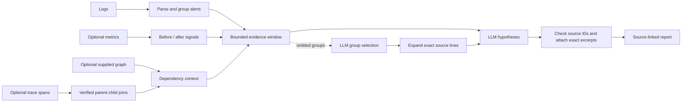

# Evidentrail

> **Product direction:** One connected-source, log-only tool for coding agents:
> backfill and keep all accessible connected logs indexed, build an
> evidence-backed service graph from the logs, and return only selected
> original lines with repeat counts when called. No user-selected time window.
> See the [product goal](docs/PRODUCT_GOAL.md) and
> [implementation plan](docs/LOG_ONLY_PRODUCT_PLAN.md). The connected flow is
> partially implemented and has not been validated against live providers.

On macOS, CloudWatch connection registration is available with an AWS profile:

```sh
target/release/evidentrail sources connect-cloudwatch \
  --account 123456789012 --region us-west-2 \
  --log-group /aws/example --profile my-readonly-profile
target/release/evidentrail sources connect-datadog --site us1
target/release/evidentrail sources rotate-datadog --connection-id ID_FROM_CONNECT
target/release/evidentrail sources list
target/release/evidentrail sources sync
target/release/evidentrail sources service install
target/release/evidentrail sources service status
target/release/evidentrail sources disconnect --source-id SOURCE_ID_FROM_LIST
EVIDENTRAIL_COMPACT_LOCAL_MODEL=qwen3:14b \
  target/release/evidentrail logs --task "Find checkout failures" \
  --max-raw-bytes 32768
```

CloudWatch registration verifies the AWS caller and log-group read access.
Datadog registration reads `DD_API_KEY` and `DD_APP_KEY` from the environment,
binds the connection to the authenticated organization, probes indexes,
online archives, and Flex separately, and reports tiers it
could not connect. Credentials are stored in separate source-bound macOS login
Keychain items; descriptors contain no keys. Both registrations create a
source-bound corpus key and encrypted local corpus, then report
`registered_backfill_pending`. `sources sync` makes bounded progress from each
durable checkpoint and replays recent history after reaching its high-water
mark. `sources watch` repeats these passes, releasing the source lock after
each pass and backing off to at most one hour when a provider or source fails.
After the recent seven-day replay completes, at most eight spare provider pages
per sync pass walk older history with a durable source-local cursor. A
completed sweep is not repeated until its boundary is at least a day old.
Source metadata exposes the historical cursor and last completed boundary;
a partial sweep is never
presented as complete provider coverage. A partition that hits a page cap is
retried at a smaller durable width on later passes.
Each pass records its outcome in the encrypted source corpus. `sources list`
shows the last attempt's result and age alongside the last successful scan's
completion time, high-water mark, age, and reconciliation state. A failed
attempt marks coverage incomplete without erasing the prior successful receipt.
These fields describe local progress; they do not establish current
authorization or complete provider coverage.
`sources service install` registers the running binary's absolute path as a
private per-user macOS LaunchAgent, starts it in the current GUI session, and
restarts it after a crash or login. Run it from a release binary kept at a
stable path. `sources service status` reports whether the plist exists and is
loaded; `sources service uninstall` stops the agent and removes only its plist.
The error log stays in `~/Library/Logs/Evidentrail/connected-sync.err`.
The service uses the same 60-second watcher and source-bound credentials; it
does not place credentials in the plist. A failed GUI bootstrap leaves the
plist installed for a later login and returns an error code. It reports provisional
coverage because provider consistency and older late arrivals are not yet
fully verified. `logs` catches up each source, excludes sources whose current
authorization or sync fails, selects groups globally, and writes original
source records as JSON lines on stdout. Source status and retrieval truncation
go to stderr as JSON. The byte budget counts original log bytes, not rendered
JSON or model tokens. The memory-only MCP server supports bounded expansion
of a selected line into chronological neighbors. Its 30-minute handle is scoped
to the selected source and native ID, and expansion checks the live source
connection again before reading the encrypted corpus. LaunchAgent startup has
not been exercised with live provider credentials; no live AWS sandbox has validated this
flow yet. Datadog identity and tier coverage have not been verified in a live
provider sandbox. Missing Datadog tiers appear as partial
coverage in connected query metadata.
If no task terms match the index, a bounded high-severity fallback samples
rare and common services plus the oldest, newest, and interior points across
observed time. Existing corpora rebuild the service summary in resumable
256-group batches on first reopen. Candidate truncation is reported; an empty
or truncated result does not prove that relevant logs are absent. A
[frozen synthetic retrieval fixture](reports/connected-retrieval-v2.md)
measures this fallback and the graph ablation, but model and live-source
quality remain unverified.
An ignored [local connected scale exercise](reports/connected-scale-local-2026-09-23.md)
checks exact old, middle, and new clues in 100,000- and 1,000,000-record
encrypted corpora. Its single-run timing observations are not production
latency or model-accuracy measurements.
An opt-in [LogHub BGL evaluation](reports/connected-loghub-bgl-2026-09-23.md)
uses pinned real system logs to check exact source lines, repeat grouping, and
bounded expansion. It remains a single-task proxy, not a downstream fix study.
When that fallback or lexical search is truncated, a connected query can
inspect up to four 32-service directory pages shared across its sources. When
more than 32 sources are eligible, pages rotate across them and report
truncation if the page budget ends first. Each service card
includes at most two short original-log examples; examples matching the
sensitive-data patterns are masked before model input. The model may choose
only advertised service IDs; code resolves those choices to at most 64
additional group cards per query before the final group selection. This can
add model calls, and the response metadata reports inspected pages, added
candidates, and directory truncation. It still cannot guarantee discovery of every
relevant log under a fixed search budget.
`sources disconnect` revokes a CloudWatch source or all tiers in one Datadog
connection, removes its encrypted local corpus and Keychain entries, and
rejects concurrent connected operations with a busy error. In-flight MCP
responses constructed before revocation may still be delivered.
`sources rotate-datadog` reads replacement keys from `DD_API_KEY` and
`DD_APP_KEY` (or named environment variables), checks that they belong to the
same organization and can search each already-connected tier. It then moves
the affected encrypted corpora out of the active paths before updating the
source-bound Keychain items, because the new keys may have narrower log access.
A successful rotation removes the old corpora and starts a fresh backfill;
records that have expired at Datadog may no longer be recoverable. Rotation
holds the source lock. A failed multi-tier update attempts to restore prior
credentials and the old corpora;
`EVIDENTRAIL_DATADOG_ROTATION_PARTIAL` means recovery must be retried before
relying on that connection. Isolated login-Keychain replacement and corpus
rebuild tests pass; rotation has not been exercised against a live Datadog
sandbox.
An interrupted rotation can leave encrypted staged corpus files in the source
directory. The CLI detects those files and excludes every tier of that Datadog
connection from queries, expansion, and sync, even if a tier still has an
active corpus. `sources list` reports `rotation_interrupted`; disconnecting
the connection removes its staged files. Recovery without disconnecting is
not implemented yet, and the connection must be rebuilt before relying on it.
Datadog role or restriction-query changes made without rotating keys are not
yet detected against previously indexed records. Do not rely on this build to
enforce newly narrowed Datadog permissions over its cached corpus; scope-change
invalidation is a release gate in the product plan.

The first log-only prototype is available as `compact`. It accepts an explicit
log stream with no time-window parameter and returns model-selected original
log lines with source IDs and repeat counts. Build it with Rust 1.88 or newer:

```sh
cargo build --release -p evidentrail-cli --bin evidentrail
EVIDENTRAIL_COMPACT_LOCAL_MODEL=qwen3:14b \
  target/release/evidentrail compact \
  --task "Find logs relevant to checkout failures" < app.log
```

`compact` requires a running local Ollama instance with the named model, or
`OPENAI_API_KEY` for hosted GPT-6 Sol. The CLI input is currently limited to
16 MiB and is not a connected, full-history index. It groups every supplied
line, lets the model select groups by ID, and resolves those IDs back to source
lines. The log-derived graph currently uses only explicit peer-service fields
and stays internal to selection. Relevance accuracy and graph benefit remain
unverified; the [plan](docs/LOG_ONLY_PRODUCT_PLAN.md) lists the evaluation and
connector work needed before calling this the finished product.

## Existing experimental commands

**Model-assisted incident analysis with source-linked evidence.**

Evidentrail groups noisy alerts, combines logs with optional metric changes
and supplied or trace-observed service relationships, and asks a model for
root-cause hypotheses.
The model can request omitted log groups before answering. The compiler attaches
exact source excerpts to cited event IDs, and the report exposes what the model
did not see. Exact provenance makes an answer auditable; it does not prove
the proposed cause is correct.



*Model hypotheses stay linked to exact, inspectable log or metric source lines.*

## Legacy incident-analysis prototype

Large logs create a bad tradeoff for an agent: send everything and waste the
context window, truncate and miss the cause, or summarize and lose the proof.
Evidentrail puts a compact, source-linked evidence layer between raw telemetry
and the reasoning model.

Give `analyze` service logs, optional metrics and dependencies, and an incident
question. It groups repeated alerts, surfaces changes, and returns up to three
source-linked hypotheses. The offline `brief` command remains available when
you need byte-exact compression with `E<n>` expansion handles.

For an on-call engineer using the older `analyze` command, the flow is:

1. Export a bounded incident window from the telemetry system and ask a
   specific question, such as “Why did checkout fail after 14:05?”
2. Review the compact JSON report: repeated warnings are counted once,
   unusual failures and relevant metric shifts are surfaced, and omitted
   evidence is disclosed.
3. Open the cited source events before acting on a hypothesis. If evidence is
   thin or conflicting, treat the result as an investigation lead rather than
   a diagnosis and expand the source window.

This older path is a CLI and machine-readable report. The connected log-only
product described above is the current direction; the legacy RCA and offline
brief commands remain available while that product is built.

| Capability | Product behavior |
|---|---|
| Alert reduction | `analyze` groups repeated alerts despite changing request IDs and embedded timestamps. |
| Model-guided retrieval | The model may request omitted log groups before forming hypotheses. |
| Service context | Supplied edges or trace-observed parent-child calls expose direct and transitive dependents. |
| Metric context | Optional before/after medians preserve exact measurement citations. |
| Checked attribution | Quotes must match visible source lines and come from the proposed service or one of its dependents. |
| Offline brief | `brief` compiles byte-exact evidence with expandable `E<n>` references, without a model call. |

The `analyze` path proposes root-cause hypotheses, but labels them as such.
Its checked citations prove quoted text and a relationship between supplied
service labels, not the labels' authenticity, the explanation, or causality. The `brief` path
is a separate offline evidence compiler.

## Accuracy is the release goal

Incident analysis is useful only if it identifies the right cause or clearly
abstains. The public RCAEval probes measure evidence coverage and selected
local-model diagnoses, but they do **not** establish general diagnosis accuracy.
No hosted run has been published yet.
A 12-case [local Qwen3 pilot](reports/rcaeval-selection/README.md#local-llm-diagnostic-pilot)
localized the service in every selected case but matched the simple baseline's
four correct service/fault pairs; that local model is not qualified for diagnosis.
A six-case [log-and-metric pilot](reports/rcaeval-selection/README.md#local-log-and-metric-pilot)
localized the service in every case but got only two fault types right, again
matching the simple metric baseline. Its mean local latency was about two
minutes per case.
An [independent 18-case log-only abstention pilot](reports/independent-log-abstention/README.md)
found that a revised causal-limit prompt kept the same two correct top-service
answers among six log-informative incidents and abstained on four of five
unresolvable cases, versus two of five before the change. It still made five
wrong top-service attributions across the set. The prompt was tuned on these
same cases, so this is a development result, not held-out validation.
On a separately frozen 12-case public injection set, both Qwen3 14B and
GPT-OSS 20B got **5/12** exact service-and-fault pairs with metric and trace
context, matching a simple largest-metric-shift baseline. Their trace runs
made seven and six wrong top attributions, respectively. Exact citations did
not imply correct causal labels. See the [paired local-model results](reports/rcaeval-selection/README.md#frozen-metric-versus-metric-and-trace-local-model-comparison).

The offline brief's matched-budget and executable results below are
**synthetic**. Real-incident accuracy remains unproven. The next release gate
is a frozen, reviewer-labeled set of approved historical incidents: compare
Evidentrail with raw truncation, grep/tail, lexical retrieval, and an optional model
challenger at the same evidence budget. Measure required-evidence recall,
false leads, correct downstream diagnosis and fix, citation validity,
abstention, latency, and token cost by incident family. Keep incident files
outside the public repository. The existing
[production shadow runner](docs/PRODUCTION_SHADOW_PILOT.md) checks exact evidence
recall and expansion; downstream diagnosis and fix still need a blinded reader
study. [Benchmark protocol](docs/EVIDENTRAILBENCH_PROTOCOL.md) defines the
broader comparison. The [local incident evaluator](docs/LOCAL_INCIDENT_EVALUATION.md)
can score an approved, labeled historical set without publishing source logs.

## Legacy command examples

Evidentrail is a Rust workspace and requires Rust 1.88 or newer.

```sh
cargo build --release -p evidentrail-cli --bin evidentrail

target/release/evidentrail analyze \
  --question "Why did the API fail?" < incident.log
```

`analyze` uses `OPENAI_API_KEY` by default and sends bounded selection and
diagnosis requests to the model provider. Redact logs before sending them. Questions can
also be read from a file so they do not appear in the process argument list.
For a local smoke run, start Ollama with a model already installed and set
`EVIDENTRAIL_ANALYZE_LOCAL_MODEL` to its name. This fixes the endpoint to
`127.0.0.1:11434` and requires no hosted key. Local model quality varies;
the same citation checks apply, and a local run is not a hosted accuracy score.
Set Ollama's context window to at least 32K for log analysis (for example,
`OLLAMA_CONTEXT_LENGTH=32768 ollama serve`). Metric-only analysis requires at
least 16K. Evidentrail rejects smaller loaded windows for these modes because
the combined public-data pilot showed prompt truncation at 16K. These minimums
do not prove every larger prompt fits; inspect Ollama's runtime logs for
truncation when evaluating a new model or incident size.

```sh
EVIDENTRAIL_ANALYZE_LOCAL_MODEL=qwen3:14b \
  target/release/evidentrail analyze \
  --question "Why did the API fail?" --topology services.json < incident.log
```

For offline, byte-exact evidence compression, use `brief`:

```sh
target/release/evidentrail brief \
  --question-file question.txt \
  --token-budget 20000 < app.log
```

The [offline brief system diagram](docs/system-design.svg) shows its separate
source-retention path.

A compiled result is deliberately inspectable:

```text
STATUS
  result: result_…
  acquisition: COMPLETE
  selection: COMPILED

EVIDENCE
  [E1]
    expand: E1 exact
    roles: query_term,failure_role,onset_role
    event_1:
      exactness: source_exact
      data: ERROR request REQ-7 upstream timed out\n

COVERAGE
  shown_verbatim: 1
  retained_raw: …
```

The result-scoped alias is not a decorative citation. In a retained product or
MCP session, `E1` is an exact, bounded retrieval capability for the underlying
event bytes.

## Model-assisted incident analysis (beta)

`analyze` accepts UTF-8 logs on explicit standard input and optionally a JSON
service graph or trace spans. It groups alerts by service and severity,
ignoring changing request, trace, and span IDs and embedded timestamp shapes
while keeping diagnostic values such as status codes distinct. It keeps rare
failures ahead of repeated warnings and sends bounded examples to a hosted
model. Adjacent lines give each failure local context. The report counts
alerts by service and lists direct and transitive dependents derived from
supplied or trace-observed edges. A failing dependency and affected callers
can be examined together. The output includes group counts, omitted-group counts,
source-line IDs, source-line SHA-256 digests, and hypotheses with exact source
excerpts. Each hypothesis has a service and a fault type (`cpu`, `mem`, `disk`,
`delay`, `loss`, `socket`, `other`, or `unknown`) so RCA evaluations can score
the pair. Invalid retrieval IDs and hypotheses with fabricated or unseen line
IDs or unrelated-service citations are discarded and counted; valid evidence
still returns in a partial report. The report labels each hypothesis's citation support as `direct`
or `dependent_only`; the latter forces a partial result because an affected
caller does not prove its dependency caused the incident. Omitted groups also
set `partial` and `needs_more_evidence: true`.
Question focus recognizes an exact service name or a unique shortened form of
a name ending in `service` (for example, “checkout” for `checkoutservice`);
ambiguous shortened names are ignored.
The model can also select up to five `model_highlights` for a compact evidence
brief, even when it abstains from a root-cause hypothesis. The compiler accepts
only visible source IDs, includes exact excerpts and SHA-256 digests, and adds
the alert group's repeat count. Duplicate IDs and multiple lines from the same
group are rejected and counted. Highlights are observations, not verified
causal explanations. A [local-model smoke check](scripts/check-evidence-highlights.py)
collapsed 500 repeated warnings in a 503-line synthetic input to one group
and verified every selected excerpt against its original line. The model still
selected that warning group, so semantic relevance needs further evaluation.
When an incident time and numeric log timestamps are available, alert groups
include counts before and after the incident within the same five-minute
window as the metrics. Logs without a usable time or outside that window are
counted separately, so chronic alerts are not silently treated as new onset.
When a log-led hypothesis points to a service with stable alert volume and a
different service has a much stronger visible metric shift, `analyze` asks the
model for an independent metric-only assessment. It exposes disagreement and
the origin of each hypothesis; a directly cited metric hypothesis may lead the
partial report. This comparison does not prove which hypothesis is causal.

Line-oriented JSON logs can use flat `message`/`service`/`level` fields or a
flattened [OpenTelemetry log record](https://github.com/open-telemetry/opentelemetry-proto/blob/main/examples/logs.json)
with `body.stringValue`, `severityText` or `severityNumber`, and a
`resource.attributes` entry for `service.name`. Each input line remains the
source for its `L<n>` citation. A complete OTLP `resourceLogs` export envelope
must be split into one record per line before analysis.

When the logs do not show the failure, an explicit metric file can add
before/after evidence. Each line is one JSON measurement with Unix-second
`timestamp`, `service`, `metric`, and finite numeric `value`:

```json
{"timestamp": 1705600751, "service": "catalogue", "metric": "cpu", "value": 49.98}
```

Use `--metrics metrics.ndjson --incident-time 1705600751` with either analysis
mode. Evidentrail computes medians from the five minutes before and after that
time, shows representative source lines under `M<n>` IDs, and checks metric
citations against those exact lines. The metric file is read only when named;
the summary does not assume units, thresholds, or causality. Metric-only
investigations can pass an empty explicit standard input stream.

If operators have independently confirmed earlier incidents, pass an explicit
`--confirmed-incidents history.json` file alongside metrics. The optional
history is a bounded JSON object with at most 256 cases:

```json
{
  "schema_version": 1,
  "incidents": [
    {
      "id": "incident-2024-017",
      "service": "catalogue",
      "fault_type": "cpu",
      "metric_family_shifts": {"cpu": 4.2, "delay": 1.1}
    }
  ]
}
```

Each shift is the maximum nonnegative relative before/after change for that
service and metric family (`cpu`, `mem`, `disk`, `delay`, `loss`, or `socket`).
For example, `diskio` maps to `disk`, `error` to `loss`, and metrics whose
names start with `latency-` map to `delay`. Evidentrail matches the current
service's metric pattern to same-service history and sends up to three closest
cases to the model. The report exposes those IDs, labels, distances, and the
SHA-256 digest of the supplied history. This is an **advisory prior**: history
labels are supplied by the operator, are not
independently validated, and cannot serve as source citations for the current
incident. Current `L<n>` or `M<n>` evidence is still required for every
hypothesis. No history is read unless this option is passed.

Pass `--traces spans.ndjson` to derive observed service edges from explicit
parent-child spans. Each line names `trace_id`, `span_id`, `parent_span_id`
(null for a root span), and `service`. Optional timing and status fields can
be supplied when `--metrics` and `--incident-time` set an incident center:

```json
{"trace_id":"t1","span_id":"s2","parent_span_id":"s1","service":"api","start_time_unix_ms":1705600751000,"duration":1234,"status_code":0,"status_code_kind":"grpc","operation":"demo.Catalogue/GetItem"}
```

The caller should select the relevant incident window before passing spans.
Evidentrail joins a child only to an unambiguous parent in the same trace,
counts missing or ambiguous parents, and records `T<n>` source-line IDs and
SHA-256 digests for each observed edge. The model receives service edges and
span counts, not raw trace IDs. An observed call is dependency evidence, not
proof of a failure cause. Input is bounded to 64 MiB and 500,000 spans.
For timed spans, the report also compares per-service span counts, median
durations, and nonzero status counts in the five minutes before and after the
incident. Duration units remain the caller's units; mixed units are invalid
for interpretation. Median example IDs (`T<n>`) point to exact trace-file
lines, and the report records each example line's and the file's SHA-256
digests. Up to 16 strongest
service timing/status summaries reach the model. A slow or nonzero-status
span can be a downstream symptom; these summaries do not prove causality.
Hypotheses require current log, metric, or visible trace-line citations.
The model can inspect at most 8 KiB of selected exact trace-line examples;
fabricated or unseen `T<n>` citations are discarded just like log and metric
citations. A cited span proves that the supplied line exists, not that the
fault began there.
When `operation` and nonzero `status_code` are supplied, the report also
counts that status per operation before and after the incident and retains an
example `T<n>` source-line ID and SHA-256 digest. It includes total operation
spans in each window so a changed status count can be read against changed
traffic. Set `status_code_kind` to `grpc` only when the code uses the
[gRPC status scheme](https://grpc.io/docs/guides/status-codes/);
then standard names such as `UNAVAILABLE` for code 14 are shown. The default
`untyped` setting leaves numeric codes uninterpreted. Operation strings are
restricted to short identifier-like names, and at most 12 new status
summaries reach the model.
When an operation's service name uniquely matches a service connected by
observed parent-child spans, the status summary names that target service;
otherwise the target stays unknown. The call relationship still does not
prove where the fault began.

```json
{
  "services": ["api", "db"],
  "dependencies": [{"from": "api", "to": "db"}]
}
```

Here `from` depends on `to`. Supply the graph only when those dependencies are
known; a connection does not establish a fault cause.

```sh
read -rs 'OPENAI_API_KEY?Paste OpenAI API key: '; export OPENAI_API_KEY; echo
target/release/evidentrail analyze \
  --question "Why did the API fail?" \
  --topology services.json < incident.log
```

The hosted path requires `OPENAI_API_KEY` and uses one bounded request for
diagnosis. When some alert groups do not fit in the first evidence window, it
uses a second bounded request so the model can choose up to four omitted groups
to inspect before diagnosing. Group selection remains advisory: every final
citation must match an exact supplied source line. The process does not retain
the log after it exits. The hosted adapter refuses
requests containing common credential patterns, including DSNs, with a
contentless error; this guard is not a complete secret detector. Redact and
review logs and trace lines before allowing their transfer to a model
provider. There is
no measured real-incident diagnosis advantage yet; use the benchmark protocol
below to compare it with the offline brief and simpler baselines. The analysis
path currently supports UTF-8, line-oriented logs only; the default brief
handles arbitrary source bytes.

Inspect the exact local evidence selection without an API key or hosted call:

```sh
target/release/evidentrail analyze \
  --question "Why did the API fail?" \
  --topology services.json --selection-only < incident.log
```

The committed synthetic selection regression places one rare database failure
at the beginning, middle, or end of 3,000 repeated API warnings. The current
selector retains that failure in all three positions at its 32 KiB example
budget; a raw 32 KiB tail retains it only at the end. This checks a specific
noise pattern, not root-cause diagnosis or real-incident performance.

A pinned, six-case [RCAEval](https://github.com/phamquiluan/RCAEval) log-only
probe is reproducible with `scripts/rcaeval-log-probe.py` after installing
`pyarrow`:

```sh
python3 -m pip install pyarrow==21.0.0
cargo build -p evidentrail-cli --bin evidentrail
python3 scripts/rcaeval-log-probe.py
python3 scripts/rcaeval-log-probe.py --with-metrics
python3 scripts/rcaeval-log-probe.py --with-metrics --metrics-only --generic-question
```

In ±5-minute windows around injected faults in one Sock Shop
service, the current parser found no alert or change from the labeled root
service in five cases and found one in the sixth. The selector marks all six
reports partial. These cases show a
real limit of logs-only diagnosis for faults whose indicators live in metrics
or traces, not a score for downstream LLM accuracy. The probe prints aggregate
counts and does not commit the downloaded telemetry.

With optional metrics, all six cases expose source-linked measurements from
the labeled service, including a large CPU median shift in the CPU case. The
largest relative shift is not always the injected fault type, so this is an
evidence-availability check, not a correct-diagnosis score.
The [combined-source probe](reports/rcaeval-selection/README.md#combined-log-and-metric-selection-probe)
also checks whether metric summaries crowd out logs and whether the model can
choose from omitted log groups. Across all 90 pinned Sock Shop cases, every
alert group from a labeled root service was either initially visible or in the
group-selection inventory, although only seven cases had such alerts at all.
This measures access to evidence, not model choice or diagnosis.

The [trace graph probe](reports/rcaeval-selection/README.md#trace-observed-service-graph-probe)
uses six pinned Online Boutique cases. It recovers nine observed cross-service
edges in each case from same-trace parent-child spans and records source-line
proof for every edge. This checks graph extraction, not causal diagnosis.
A [frozen 12-case local-model comparison](reports/rcaeval-selection/README.md#frozen-metric-versus-metric-and-trace-local-model-comparison)
found 3/12 exact service-and-fault matches with metrics alone and 5/12 with
metrics plus traces, equal to the simple metric baseline. The trace arm also
made seven wrong top attributions versus two with metrics alone; trace input
is optional and its diagnostic benefit is unproven.

The generic-question, metric-only probe removes the labeled service from the
question and excludes logs that may contain credentials. Its selected evidence
still contains a measurement from the labeled service in these six cases and four
additional cases from other Sock Shop services. The benchmark script uses the
labels only after selection to score coverage; no LLM diagnosis result has
been measured. The [RCAEval selection report](reports/rcaeval-selection/README.md)
records pinned case-level aggregate output. Across all 90 RE2 Sock Shop cases,
a simple largest-metric-shift baseline identifies the labeled service in 84
but the service-and-fault pair in only 37. A future LLM result must be compared
against this baseline and tested on a separate held-out set.

Once `OPENAI_API_KEY` is configured, the same script can run the hosted model
with `--with-metrics --metrics-only --generic-question --live-model`. It reports
top-one and top-three service/fault matches, abstentions, `unknown` fault-type
answers, requests for more evidence, citation count, and latency without
printing model explanations or raw telemetry. A real accuracy claim needs a
larger held-out set and comparisons against simple metric and log baselines.
Save a preselected case list to a JSONL run and score it with
`python3 scripts/score-rcaeval-live.py RUN.jsonl`. The scorer compares top-one
service-plus-fault hits with the paired largest-shift baseline and rejects
incomplete, duplicated, or failed runs rather than dropping them from the
denominator. It also counts direct versus dependent-only hypothesis support.
The currently published 90-case baseline has already informed
selection changes, so it is exploratory rather than a fresh held-out test.

## How it works

1. **Acquire explicitly.** The caller supplies the byte stream. The product
   does not crawl a repository, discover files, or inspect ambient logs.
2. **Frame reversibly.** Records, malformed bytes, duplicates, and multiline
   failures are represented without destroying source fidelity.
3. **Build independent evidence lanes.** Exact query matches, failure context,
   raw coverage, and narrowly authorized provider relations contribute
   candidates with explicit provenance.
4. **Preserve mandatory evidence.** Feasibility is checked before optional
   evidence or any hosted ranking can influence selection.
5. **Pack to the real render budget.** A deterministic, diversity-aware
   selector chooses intact evidence packets using certified composable costs.
6. **Render and receipt.** The brief exposes what was shown, what remains
   retained, and how each source-exact citation can be expanded.

The same authorized input, question, policy, and budget produce the same
deterministic result.

## Optional hosted ranking

Hosted ranking is an explicit, memory-only beta. It can reorder a bounded set
of intact optional evidence blocks; it cannot edit evidence, create citations,
remove mandatory evidence, decide completeness, or generate the final answer.

The preferred mode uses deterministic selective escalation:

```sh
read -rs 'OPENAI_API_KEY?Paste OpenAI API key: '; export OPENAI_API_KEY; echo

target/release/evidentrail brief \
  --question "Why did request REQ-7 fail?" \
  --token-budget 20000 \
  --llm-rank-if-contended < approved.log
```

`--llm-rank-if-contended` calls only when deterministic packing excluded at
least one model-visible optional block—an auditable opportunity for ranking to
change membership. It is not a model-confidence claim. `--llm-rank` retains
the unconditional evaluation path.

Both modes make at most one call, never retry within the request, and fall back
to the already-computed deterministic result on missing credentials, timeout,
provider failure, policy denial, or invalid structured output. Set
`EVIDENTRAIL_HOSTED_RANKING_SHADOW=1` to exercise an explicitly requested
hosted path while always publishing deterministic bytes. The kill switch is
`EVIDENTRAIL_HOSTED_RANKING_DISABLED=1`.

The current hosted candidate is **not qualified for product admission**. Its
approved synthetic characterization returned valid rankings but took
1.501–2.236 seconds end to end, exceeding the unchanged 800 ms provider
deadline. No hosted accuracy improvement has yet been established. See the
[hosted ranking contract](docs/HOSTED_EVIDENCE_RANKING.md) and
[selective-ranking release gates](docs/SELECTIVE_HOSTED_RANKING_RELEASE_PLAN.md).
The `live-ranking-measure` stage therefore runs the full 18-call pilot corpus
with a 15-second hang ceiling and treats latency as an observation: it can
complete on validity, integrity, and cost without granting production
admission. Its p50/p95/p99 results are the evidence used to set a product SLO.
The qualification program includes an optional three-call, evaluation-only
screen of the dated `gpt-5.4-nano-2026-03-17` snapshot at the same 800 ms
deadline. That model is documented for speed-sensitive ranking workloads, but
the screen cannot repin or admit it; a full frozen quality and outcome bakeoff
would still be required.

## MCP for agent tool loops

Run the process-resident MCP server:

```sh
target/release/evidentrail serve-mcp
```

On macOS the memory-only server exposes four tools:

- `evidentrail_logs` compiles explicitly supplied, bounded log bytes.
- `evidentrail_expand` resolves an advertised result-scoped alias without
  rereading or widening the original source.
- `evidentrail_connected_logs` takes a task and optional `max_raw_bytes` budget,
  catches up locally connected sources, and returns selected original records
  as JSONL plus separate coverage metadata and a 30-minute `result_id`.
- `evidentrail_connected_expand` takes that `result_id` and a selected
  `source_id`/`native_id` pair, with optional `before`, `after` (at most 32 each),
  and `max_raw_bytes` (at most 256 KiB). It returns exact chronological neighbors
  and reports when either side was truncated. Expansion attempts source catch-up
  and refuses the read if source authorization or sync cannot be verified.

`ranking_mode` defaults to `deterministic`. The only hosted alternatives are
`hosted` and `hosted_if_contended`; both require request-level opt-in.
Process-resident results expire after 30 minutes or when the server exits.

## Trust boundary

The contracts are intentionally stricter than ordinary retrieval pipelines:

- Input logs and all returned evidence are marked as untrusted data.
- Candidate blocks are intact and use reversible byte escaping.
- Mandatory evidence and budget feasibility are resolved before hosted egress.
- A hosted response must be a complete permutation of submitted opaque IDs.
- Unknown, duplicate, missing, malformed, or foreign IDs invalidate the whole
  proposal.
- Diagnostics are contentless: configuration digests, timing, token/cost
  counters, validation outcome, and fallback reason—not prompts or responses.
- Durable retention is encrypted and fails closed when its external authority
  is unavailable.

Read the [threat model](docs/THREAT_MODEL.md),
[Log Brief contract](docs/LOG_BRIEF_CONTRACT.md), and
[local data policy](docs/LOCAL_DATA_POLICY.md) for the normative boundary.

## What is proven today

The deterministic product has unit, property, integration, golden, executable
incident, and byte-integrity coverage across the workspace. Frozen hermetic
corpora exercise exact recall, abstention, adversarial bytes, mandatory
feasibility, expansion, and downstream diagnosis contracts. The streaming V3
path has validation fixtures up to 1,000,000 records / 1 GiB behind its rollout
gate.

The frozen matched-budget value benchmark is directly reproducible:

```sh
scripts/production-qualification.sh value
```

It writes private, contentless `product-value.json`, `executable-value.json`, and
`value-decision.json` reports outside the repository. On the current frozen
eight-incident corpus, Evidentrail preserves 100% of required evidence with 8/8
perfect cases. At the same per-case source-byte ceiling, raw truncation preserves
23.75% (0/8 perfect), grep/head-tail 52.5% (3/8), quota hybrid 61.25% (3/8),
and BM25F-style retrieval 23.75% (1/8). On three separate executable synthetic
incidents, Evidentrail artifacts under a 7,000-byte per-case ceiling produce 3/3
verified fixture-agent repairs with valid source citations and reduce 61,927
source bytes to 10,122 artifact bytes; raw prefix produces 0/3 verified repairs.
These are synthetic conformance results, not real-incident or hosted-model
population claims.

Before a repeated live OpenAI product-value demonstration, `live-demo-pilot`
makes 18 calls to validate the evaluation contract. The evaluation-only reader
uses a 15-second deadline, normalizes set ordering, and scores frozen semantic
cause rules separately from exact private label spelling. Production hosted
ranking retains its independent 800 ms gate. After the pilot passes, `live-demo`
makes 180 sequential calls through one persistent client: three executable
incidents, three matched-budget arms, and 20 repetitions. A balanced randomized
crossover schedule controls call-order effects. The contentless report compares
semantic root-cause diagnosis, exact-code matches, citation-supported success,
worst-case success, latency, tokens, cost, output reduction, and paired
bootstrap bounds. `live-campaign`
combines this with the latency challenger, hosted-ranker qualification, and a
qualification-gated 100-call production soak for a maximum of 664 calls. Neither
mode converts synthetic results into a real-incident claim.

Those results are engineering evidence, not a population-level claim about all
production incidents. Hosted ranking still requires a passing frozen
multi-provider benchmark and approved realistic shadow operation. Current
claims and open gaps are maintained in
[implementation status](docs/IMPLEMENTATION_STATUS.md) and the
[product roadmap](docs/PRODUCT_ROADMAP.md).

Approved historical incidents can be evaluated with the memory-only,
contentless-reporting
[`evidentrail-production-shadow`](docs/PRODUCTION_SHADOW_PILOT.md) runner. It is
deterministic by default and can exercise the real pinned OpenAI ranking path
only through explicit manifest- and case-level egress approval. Real incident
material must remain outside this repository and ordinary CI.

The staged [production qualification program](docs/PRODUCTION_QUALIFICATION.md)
runs the full no-egress contract/resource preflight, a 180-call live product
comparison, a 21-call hosted-ranker pilot, an up-to-381-call scored hosted
evaluation, and a 100-call production-path soak.
Each paid stage requires an explicit cost ceiling and later stages stop when an
earlier production gate fails. Every live report now joins the deterministic
value evidence, hosted incremental-value gates, and production-path smoke into
one `live-decision.json` admission verdict.

## Development

```sh
cargo fmt --all -- --check
cargo clippy --workspace --all-targets --all-features -- -D warnings
cargo test --workspace --all-features
```

The workspace keeps acquisition, framing, evidence construction, selection,
rendering, wire contracts, encrypted retention, product orchestration, CLI/MCP,
and benchmarking in separate crates. The core compiler remains network- and
credential-free.

## License

Licensed under either [Apache 2.0](LICENSE-APACHE) or [MIT](LICENSE-MIT), at
your option.
